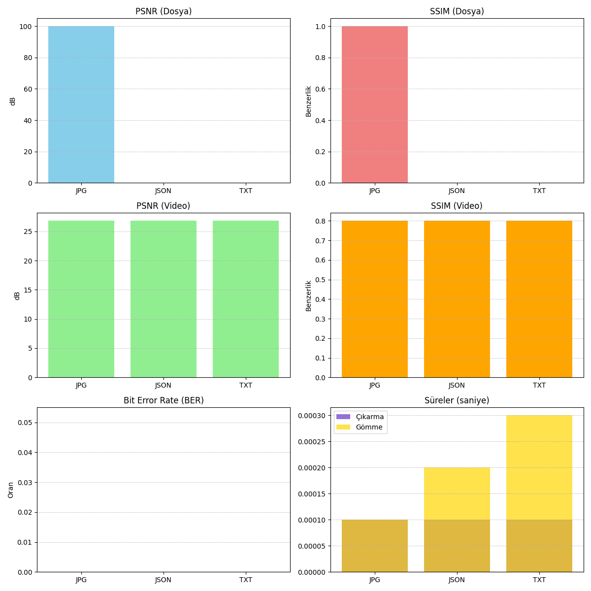

# Motion Vector Tabanlı Veri Gizleme ve Çıkarma

Bu proje, videoların alt piksellerinde veri saklamayı sağlayan bir **video steganografi** sistemidir. JPG, JSON ve TXT gibi veriler video karelerine gömülüp daha sonra yüksek doğrulukla geri çıkarılabilir. Ayrıca kalite metrikleri (PSNR, SSIM, BER) hesaplanarak görsel grafik halinde sunulur.

## 🗂️ Proje Dosya Yapısı

```
MotionVector/
├── coastguard_cif.avi               # Girdi videosu
├── secret.jpg / .json / .txt       # Saklanacak dosyalar
├── datahidden_*.avi                # Gömülü video çıktıları
├── extracted_*.{ext}               # Çıkarılan veri dosyaları
├── datahide_motion_vector.py       # Veri gömme betiği
├── dataextraction_motion_vector.py # Veri çıkarma betiği
├── test.py                         # Performans ve kalite testi
├── motion_vector_results.csv       # Metrik sonuçları (CSV)
└── test_results.png                # Grafik çıktı
```

## 🚀 Kullanım Adımları

### 1. Veriyi Videoya Gömme

```bash
python datahide_motion_vector.py
```

- `secret.jpg`, `secret.json`, veya `secret.txt` dosyalarından birini seçin.
- Seçilen veri `coastguard_cif.avi` içerisine gömülür.
- Çıktı: `datahidden_<type>.avi`

### 2. Gömülü Veriyi Geri Çıkarma

```bash
python dataextraction_motion_vector.py
```

- Gömülü veriyi içeren `.avi` dosyasını seçin.
- Çıkarılan veri `extracted_<type>_data.<type>` adıyla kaydedilir.

### 3. Kalite ve Başarı Testi

```bash
python test.py
```

- Bit Hata Oranı (BER), PSNR ve SSIM hesaplanır.
- Sonuçlar: `motion_vector_results.csv`
- Grafik çıktı: `test_results.png`

## 📊 Ölçülen Metrikler

| Metrik         | Açıklama                                      |
|----------------|-----------------------------------------------|
| BER            | Bit bazlı hata oranı                          |
| PSNR (dB)      | Görsel kalite ölçümü (Yüksek = daha iyi)      |
| SSIM (0-1)     | Görsel benzerlik (1 = birebir aynı)           |
| Embed/Extract  | Gömme ve çıkarma süreleri (saniye)            |

## 📈 Örnek Sonuç Grafiği



## 📦 Gereksinimler

```bash
pip install opencv-python numpy matplotlib scikit-image
```

## ⚙️ Teknik Detaylar

- Her karede alt iki satır (2x8 byte = 16 byte) kullanılmaktadır.
- Gömülen verinin başında 4 byte uzunluk bilgisi saklanır.
- Video `HFYU` (HuffYUV) codec’i ile sıkıştırılır (kaybı minimumda tutmak için).
- Desteklenen dosya türleri: `.txt`, `.json`, `.jpg`, `.png`.

## 📌 Notlar

- Maksimum veri kapasitesi: `16 * toplam_kare_sayısı` byte.
- Kodlar `MotionVector/` dizininde çalıştırılmalıdır.
- Görüntü çözünürlüğü çok düşükse gömme başarısız olabilir.

---

🛠 Geliştirici: [Vahdet Eren Bozyil]  
📅 Proje: Motion Vector tabanlı veri gizleme (2025)
